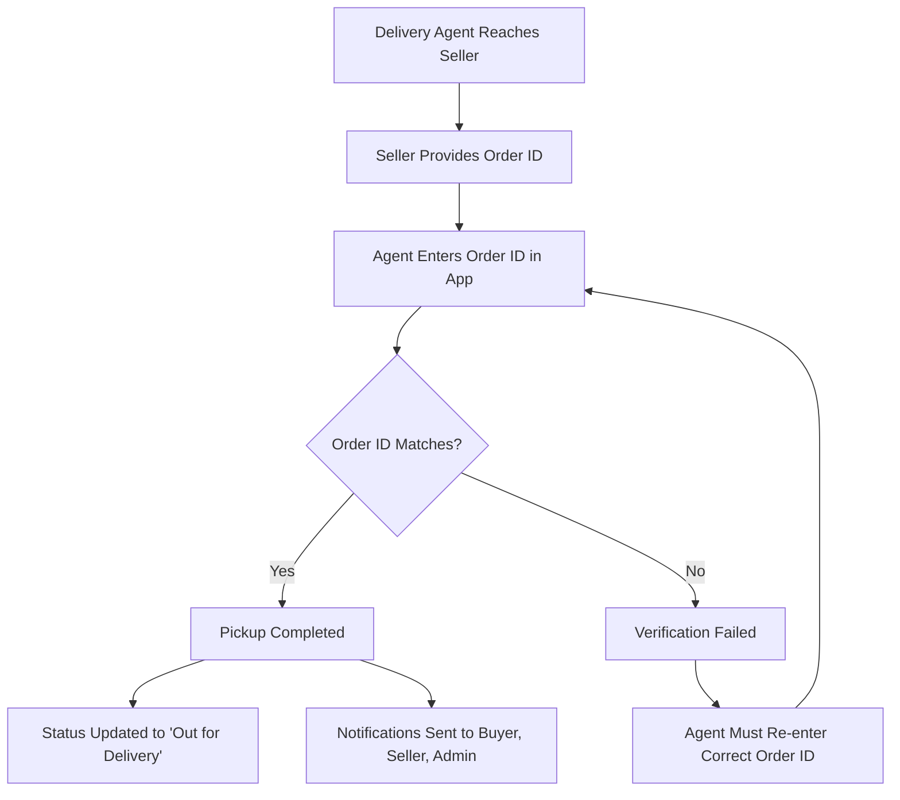

# 🚚 Delivery Agent Verification System

## Overview

The Delivery Agent Verification System ensures secure and accurate order pickup by requiring delivery agents to verify the order ID with the seller before completing pickup. This system prevents unauthorized pickups and ensures order integrity throughout the delivery process.

## 🔄 System Flow



## 🏗️ Architecture

### Backend Components

1. **Order Model** (`backend/models/Order.js`)
   - `orderNumber`: Unique identifier for verification
   - `pickup`: Object containing pickup verification data
   - `deliveryAgent`: Object tracking agent assignment and status
   - `completePickup()`: Method for completing pickup verification

2. **DeliveryAgent Model** (`backend/models/DeliveryAgent.js`)
   - `currentOrder`: Currently assigned order
   - `assignedOrders`: Array of assigned orders
   - `status`: Agent availability status
   - Performance tracking and statistics

3. **OtpVerification Model** (`backend/models/OtpVerification.js`)
   - OTP generation and verification for delivery confirmation
   - Expiry and attempt tracking
   - Integration with Twilio SMS service

### Frontend Components

1. **OrderPickup Component** (`frontend/src/pages/delivery/OrderPickup.js`)
   - Order ID verification input field
   - Pickup notes textarea
   - Location tracking integration
   - Form validation and error handling

2. **DeliveryDashboard Component** (`frontend/src/pages/delivery/DeliveryDashboard.js`)
   - Order management interface
   - Pickup completion modal
   - Real-time status updates

## 🔐 Security Features

### Order ID Verification
- **Exact Match Required**: Order ID must match exactly (case-sensitive)
- **Whitespace Handling**: Leading/trailing whitespace is trimmed
- **Length Validation**: Prevents extremely long inputs
- **Real-time Validation**: Immediate feedback on incorrect entries

### Authorization
- **Agent Authentication**: JWT token required for all operations
- **Order Ownership**: Only assigned agents can complete pickup
- **Status Validation**: Prevents duplicate or invalid operations

### Data Integrity
- **Database Transactions**: Atomic operations ensure consistency
- **Referential Integrity**: All foreign key relationships maintained
- **Audit Trail**: Complete order timeline tracking

## 📱 User Interface

### Pickup Verification Form

```jsx
// Order ID Input Field
<input
  type="text"
  id="orderIdVerification"
  name="orderIdVerification"
  required
  value={orderIdVerification}
  onChange={handleInputChange}
  placeholder="Enter the order ID provided by seller"
/>

// Pickup Notes
<textarea
  id="pickupNotes"
  name="pickupNotes"
  rows={3}
  value={pickupNotes}
  onChange={handleInputChange}
  placeholder="Any additional notes about the pickup (optional)"
/>
```

### Progress Indicator

```jsx
// Visual progress tracking
<ol className="flex items-center">
  <li>✅ Order Accepted</li>
  <li>🔄 Pickup in Progress</li>
  <li>⏳ Delivery</li>
</ol>
```

## 🔧 API Endpoints

### Complete Pickup
```http
PUT /api/delivery/orders/:id/pickup
Authorization: Bearer <agent_token>
Content-Type: application/json

{
  "orderIdVerification": "ORD123456789",
  "pickupNotes": "Items collected successfully"
}
```

**Response (Success):**
```json
{
  "success": true,
  "message": "Order pickup completed successfully",
  "data": {
    "_id": "order_id",
    "orderNumber": "ORD123456789",
    "status": "Out_for_Delivery",
    "deliveryStatus": "pickup_completed",
    "pickup": {
      "isCompleted": true,
      "completedAt": "2024-01-15T10:30:00Z",
      "notes": "Items collected successfully"
    }
  }
}
```

**Response (Error):**
```json
{
  "success": false,
  "message": "Order ID verification failed. Please check with seller and try again.",
  "code": "ORDER_ID_MISMATCH",
  "details": {
    "provided": "WRONG_ORDER_ID",
    "expected": "ORD123456789"
  }
}
```

## 🔔 Notification System

### Real-time Notifications

When pickup is completed successfully, notifications are sent to:

1. **Buyer** (`global.emitToBuyer`)
   ```json
   {
     "event": "order-pickup-completed",
     "data": {
       "orderNumber": "ORD123456789",
       "status": "Out_for_Delivery",
       "pickupTime": "2024-01-15T10:30:00Z",
       "deliveryAgent": {
         "name": "John Doe",
         "phone": "+919876543210"
       }
     }
   }
   ```

2. **Seller** (`global.emitToSeller`)
   ```json
   {
     "event": "order-pickup-completed",
     "data": {
       "orderNumber": "ORD123456789",
       "status": "Out_for_Delivery",
       "pickupTime": "2024-01-15T10:30:00Z",
       "deliveryAgent": {
         "name": "John Doe",
         "phone": "+919876543210"
       }
     }
   }
   ```

3. **Admin** (`global.emitToAdmin`)
   ```json
   {
     "event": "order-pickup-completed",
     "data": {
       "orderNumber": "ORD123456789",
       "status": "Out_for_Delivery",
       "pickupTime": "2024-01-15T10:30:00Z",
       "deliveryAgent": {
         "name": "John Doe",
         "phone": "+919876543210",
         "vehicleType": "bike"
       },
       "customer": {
         "name": "Jane Smith",
         "phone": "+919876543211"
       },
       "seller": {
         "name": "ABC Store",
         "address": "123 Main St"
       }
     }
   }
   ```

## 🧪 Testing

### Backend Tests

Run backend tests:
```bash
cd backend
npm test -- --testPathPattern=deliveryAgentVerification.test.js
```

**Test Coverage:**
- ✅ Order ID verification logic
- ✅ Authorization and security
- ✅ Database consistency
- ✅ Error handling
- ✅ Edge cases and validation
- ✅ Notification system
- ✅ Performance metrics updates

### Frontend Tests

Run frontend tests:
```bash
cd frontend
npm test -- --testPathPattern=deliveryAgentVerification.test.js --watchAll=false
```

**Test Coverage:**
- ✅ Form validation
- ✅ User interaction
- ✅ Error handling
- ✅ Loading states
- ✅ Location integration
- ✅ Accessibility
- ✅ Component rendering

### Comprehensive Test Suite

Run all tests:
```bash
node scripts/test-delivery-verification.js
```

**Available Options:**
- `--backend`: Run only backend tests
- `--frontend`: Run only frontend tests
- `--db-only`: Run only database connectivity test
- `--help`: Show help message

## 🚀 Deployment

### Environment Variables

**Backend (.env):**
```env
# Database
MONGODB_URI=mongodb://localhost:27017/zammer
MONGODB_TEST_URI=mongodb://localhost:27017/zammer_test

# JWT
JWT_SECRET=your_jwt_secret_key

# Twilio (for OTP)
TWILIO_ACCOUNT_SID=your_twilio_account_sid
TWILIO_AUTH_TOKEN=your_twilio_auth_token
TWILIO_VERIFY_SERVICE_SID=your_verify_service_sid

# SMEPay (for payments)
SMEPAY_CLIENT_ID=your_smepay_client_id
SMEPAY_CLIENT_SECRET=your_smepay_client_secret
SMEPAY_MODE=sandbox
```

**Frontend (.env):**
```env
REACT_APP_API_URL=http://localhost:5001/api
REACT_APP_WS_URL=ws://localhost:5001
```

### Database Setup

1. **Create Test Database:**
   ```bash
   mongo
   use zammer_test
   ```

2. **Run Migrations:**
   ```bash
   cd backend
   npm run migrate
   ```

3. **Seed Test Data:**
   ```bash
   npm run seed:test
   ```

### Production Deployment

1. **Build Frontend:**
   ```bash
   cd frontend
   npm run build
   ```

2. **Start Backend:**
   ```bash
   cd backend
   npm start
   ```

3. **Verify System:**
   ```bash
   node scripts/test-delivery-verification.js
   ```

## 📊 Monitoring

### Key Metrics

1. **Pickup Success Rate**: Percentage of successful pickups
2. **Verification Failure Rate**: Percentage of failed order ID verifications
3. **Average Pickup Time**: Time from assignment to completion
4. **Agent Performance**: Individual agent statistics

### Logging

**Backend Logs:**
```javascript
// Pickup completion log
console.log('✅ PICKUP_COMPLETE_SUCCESS', {
  agentId,
  orderId,
  pickupTime: pickupTime.toISOString(),
  processingTime: `${Date.now() - startTime}ms`
});

// Verification failure log
console.log('❌ PICKUP_ORDER_ID_MISMATCH', {
  orderId,
  providedId: orderIdVerification.trim(),
  actualOrderNumber: order.orderNumber
});
```

**Frontend Logs:**
```javascript
// Successful pickup
console.log('✅ Pickup completed successfully');

// Validation error
console.log('❌ Order ID verification failed');
```

## 🔧 Troubleshooting

### Common Issues

1. **Order ID Mismatch**
   - **Cause**: Incorrect order ID entered by agent
   - **Solution**: Verify order ID with seller, check for typos

2. **Authorization Failed**
   - **Cause**: Invalid or expired JWT token
   - **Solution**: Re-login to get fresh token

3. **Database Connection Error**
   - **Cause**: MongoDB connection issues
   - **Solution**: Check database status and connection string

4. **Notification Failure**
   - **Cause**: WebSocket connection issues
   - **Solution**: Check WebSocket server status

### Debug Mode

Enable debug logging:
```bash
# Backend
DEBUG=delivery:* npm start

# Frontend
REACT_APP_DEBUG=true npm start
```

## 📈 Performance Optimization

### Database Indexes

```javascript
// Order model indexes
db.orders.createIndex({ "orderNumber": 1 })
db.orders.createIndex({ "deliveryAgent.agent": 1 })
db.orders.createIndex({ "status": 1 })

// DeliveryAgent model indexes
db.deliveryagents.createIndex({ "status": 1 })
db.deliveryagents.createIndex({ "currentOrder": 1 })
```

### Caching

```javascript
// Redis caching for frequently accessed data
const cacheKey = `order:${orderId}`;
await redis.setex(cacheKey, 300, JSON.stringify(orderData));
```

## 🔒 Security Best Practices

1. **Input Validation**: All inputs are validated and sanitized
2. **Rate Limiting**: API endpoints have rate limiting
3. **Authentication**: JWT tokens with expiration
4. **Authorization**: Role-based access control
5. **Audit Trail**: Complete operation logging
6. **Data Encryption**: Sensitive data encrypted at rest

## 📚 API Documentation

### Complete API Reference

For complete API documentation, see:
- [Backend API Docs](backend/docs/API.md)
- [Frontend Component Docs](frontend/docs/COMPONENTS.md)

### Postman Collection

Import the Postman collection for testing:
- [Delivery Agent API Collection](docs/postman/DeliveryAgentAPI.json)

## 🤝 Contributing

### Development Setup

1. **Clone Repository:**
   ```bash
   git clone <repository-url>
   cd zammer
   ```

2. **Install Dependencies:**
   ```bash
   # Backend
   cd backend && npm install
   
   # Frontend
   cd frontend && npm install
   ```

3. **Run Development Servers:**
   ```bash
   # Backend (Terminal 1)
   cd backend && npm run dev
   
   # Frontend (Terminal 2)
   cd frontend && npm start
   ```

4. **Run Tests:**
   ```bash
   node scripts/test-delivery-verification.js
   ```

### Code Standards

- **ESLint**: Follow project ESLint configuration
- **Prettier**: Use Prettier for code formatting
- **Jest**: Write comprehensive tests
- **JSDoc**: Document all functions and components

## 📞 Support

For technical support or questions:
- **Email**: support@zammer.com
- **Documentation**: [docs.zammer.com](https://docs.zammer.com)
- **Issues**: [GitHub Issues](https://github.com/zammer/issues)

---

**Last Updated**: January 15, 2024  
**Version**: 1.0.0  
**Status**: ✅ Production Ready
